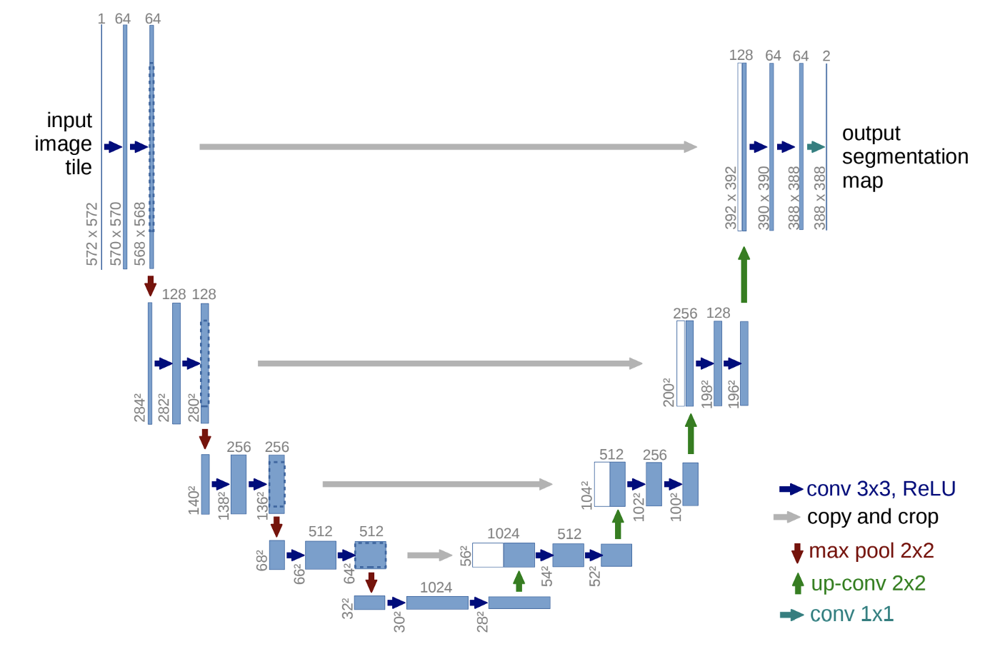
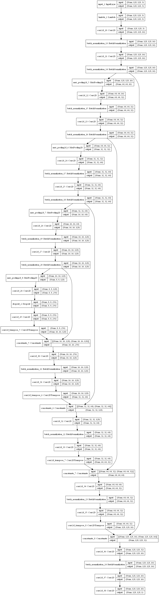

# [Kaggle] DATA-SCIENCE-BOWL-2018
## : Find the nuclei in divergent images to advance medical discovery

- Tensorflow
- Keras

## 1. Dataset
datset that I've used --> Kaggle data-science-bowl-2018
https://www.kaggle.com/c/data-science-bowl-2018/data

## 2. IoU metric
The intersection over union (IoU) metric is a simple metric used to evaluate the performance of a segmentation algorithm.

## 3. U-Net
I used U-Net network, which is the famous one as convolutional networks for Biomedical image segmentation.

https://arxiv.org/pdf/1505.04597.pdf

## plot model

## 4. Result

This notebook took inspiration from: https://www.kaggle.com/keegil/keras-u-net-starter-lb-0-277

